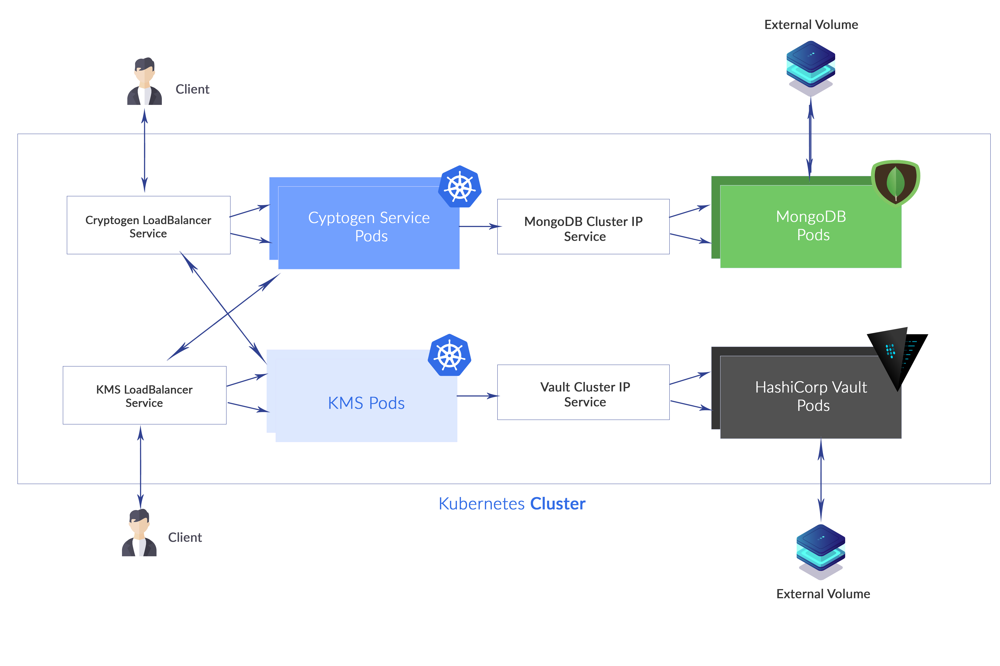

# Deployment 
This repo contains all the manifest files for assignment application deployment on kubernetes cluster.

# Deployment Diagram


# Prerequisite

Create a Kubernetes cluster with either [Minikube](https://kubernetes.io/docs/getting-started-guides/minikube) for local testing, or with any cloud provider (AWS, GC, Azure).

# Steps

1. [Clone the repo](#1-clone-the-repo)


### 1. Clone the repo

Clone the `deployment manifest files` locally.

```
$ git clone https://github.com/Dpk28/deployment.git
```
```
$ cd deployment
```

### 2. Deploy vault 

Create vault deployment object 
```
$ kubectl create -f vault/vault.yaml
```

Create vault service object 
```
$ kubectl create -f vault/vault_service.yaml
```

### 3. Deploy mongo DB  

Create mongoDB deployment object 
```
$ kubectl create -f mongodb/mongo.yaml
```

Create mongoDB service object 
```
$ kubectl create -f mongodb/mongo_service.yaml
```

### 4. Deploy KMS micro-service 

Create KMS deployment object 
```
$ kubectl create -f kms/kms_deployment.yaml
```

Create KMS service object 
```
$ kubectl create -f kms/kms_service.yaml
```

### 5. Deploy cryptogen micro-service 

Create Cryptogen deployment object 
```
$ kubectl create -f cryptogen/cryptogen_deployment.yaml
```

Create KMS service object 
```
$ kubectl create -f cryptogen/cryptogen_service.yaml
```


